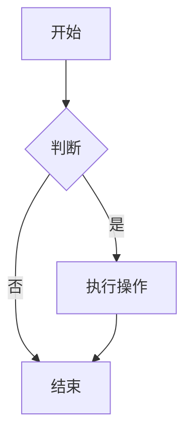
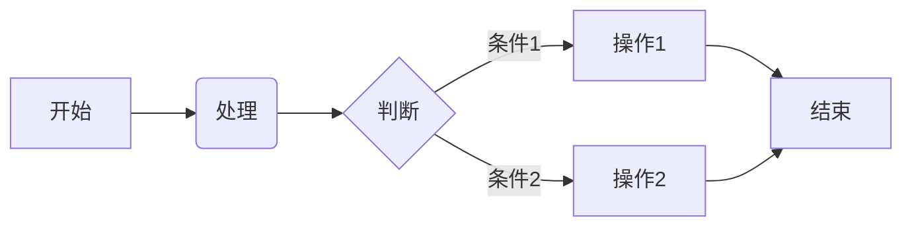
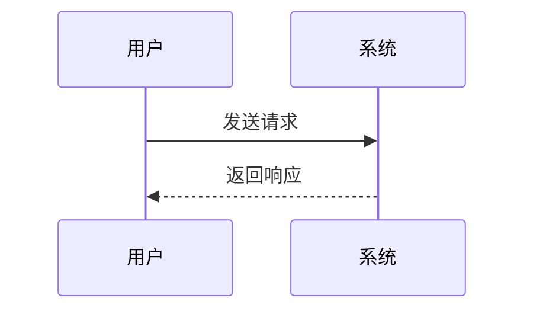
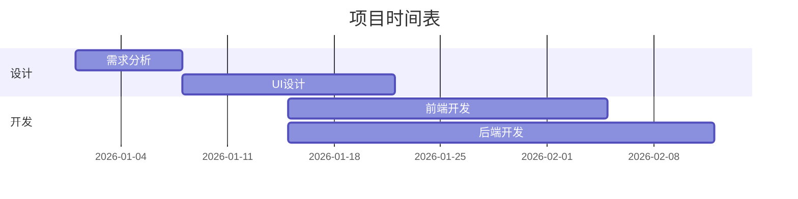

# Markdown 写作教程 📝

全面的 Markdown 写作指南，从基础语法到高级技巧，帮助你写出优雅的文档。

---

## 📚 目录

- [快速开始](#快速开始)
- [基础语法](#基础语法)
- [进阶技巧](#进阶技巧)
- [最佳实践](#最佳实践)
- [常用工具](#常用工具)
- [模板示例](#模板示例)
- [常见问题](#常见问题)
- [参考资料](#参考资料)

---

## 🚀 快速开始

### 什么是 Markdown？

Markdown 是一种轻量级标记语言，由 John Gruber 于 2004 年创建。它使用简单的符号来格式化文本，易于阅读和编写，同时可以轻松转换为 HTML。

### 为什么使用 Markdown？

- ✅ **简单易学**：语法简洁，上手快
- ✅ **纯文本格式**：兼容所有文本编辑器
- ✅ **跨平台**：Windows、macOS、Linux 都支持
- ✅ **版本控制友好**：与 Git 完美配合
- ✅ **转换灵活**：可导出为 HTML、PDF、Word 等格式
- ✅ **广泛支持**：GitHub、GitLab、Notion 等平台都支持

### 快速示例

```markdown
# 一级标题

这是**粗体**文本，这是*斜体*文本。

## 二级标题

- 列表项 1
- 列表项 2

### 三级标题

1. 有序列表项 1
2. 有序列表项 2

> 这是一个引用块

`这是行内代码`

```
这是代码块
```

[这是一个链接](https://example.com)


```

---

## 📖 基础语法

### 标题

使用 `#` 号来表示标题，`#` 的数量对应标题级别（1-6 级）。

```markdown
# 一级标题
## 二级标题
### 三级标题
#### 四级标题
##### 五级标题
###### 六级标题
```

**效果：**
# 一级标题
## 二级标题
### 三级标题
#### 四级标题
##### 五级标题
###### 六级标题

### 文本格式

#### 粗体
```markdown
**粗体文本**
__粗体文本__
```

#### 斜体
```markdown
*斜体文本*
_斜体文本_
```

#### 粗斜体
```markdown
***粗斜体文本***
___粗斜体文本___
```

#### 删除线
```markdown
~~删除线文本~~
```

#### 下划线
```markdown
<u>下划线文本</u>
```

#### 行内代码
```markdown
`行内代码`
```

### 列表

#### 无序列表
使用 `-`、`+` 或 `*` 符号：

```markdown
- 项目 1
- 项目 2
  - 子项目 2.1
  - 子项目 2.2
- 项目 3
```

**效果：**
- 项目 1
- 项目 2
  - 子项目 2.1
  - 子项目 2.2
- 项目 3

#### 有序列表
使用数字加点：

```markdown
1. 第一项
2. 第二项
   1. 子项 2.1
   2. 子项 2.2
3. 第三项
```

**效果：**
1. 第一项
2. 第二项
   1. 子项 2.1
   2. 子项 2.2
3. 第三项

#### 任务列表
```markdown
- [x] 已完成的任务
- [ ] 未完成的任务
- [ ] 待办事项
```

**效果：**
- [x] 已完成的任务
- [ ] 未完成的任务
- [ ] 待办事项

### 引用

使用 `>` 符号：

```markdown
> 这是一个引用块
> 可以包含多行文本
> > 嵌套引用
```

**效果：**
> 这是一个引用块
> 可以包含多行文本
> > 嵌套引用

### 代码块

使用三个反引号 \`\`\` 包裹：

````markdown
```python
def hello_world():
    print("Hello, World!")
```
````

**效果：**
```python
def hello_world():
    print("Hello, World!")
```

#### 指定语言高亮
```markdown
```javascript
function greet(name) {
    return `Hello, ${name}!`;
}
```
```

#### 无语言代码块
```markdown
```
纯文本代码块
```
```

### 链接

```markdown
[链接文本](https://example.com "可选标题")
```

**效果：**
[链接文本](https://example.com "可选标题")

#### 相对链接
```markdown
[相对链接](./docs/guide.md)
```

#### 锚点链接
```markdown
[跳转到基础语法](#基础语法)
```

### 图片

```markdown

```

**示例：**
```markdown

```

#### 调整图片大小
```markdown

```

### 表格

```markdown
| 表头 1 | 表头 2 | 表头 3 |
|--------|--------|--------|
| 内容 1 | 内容 2 | 内容 3 |
| 内容 4 | 内容 5 | 内容 6 |
```

**效果：**
| 表头 1 | 表头 2 | 表头 3 |
|--------|--------|--------|
| 内容 1 | 内容 2 | 内容 3 |
| 内容 4 | 内容 5 | 内容 6 |

#### 对齐方式
```markdown
| 左对齐 | 居中对齐 | 右对齐 |
|:-------|:--------:|-------:|
| 左     | 中       |     右 |
```

**效果：**
| 左对齐 | 居中对齐 | 右对齐 |
|:-------|:--------:|-------:|
| 左     | 中       |     右 |

### 分隔线

使用三个或更多 `-`、`*` 或 `_`：

```markdown
---
***
___
```

**效果：**
---
***
___

### 水平线

同分隔线。

### 行内公式

使用 `$` 符号（需要 MathJax 支持）：

```markdown
这是一个行内公式：$E = mc^2$
```

**效果：**
这是一个行内公式：$E = mc^2$

### 块级公式

使用 `$$` 符号：

```markdown
$$
\sum_{i=1}^{n} i = \frac{n(n+1)}{2}
$$
```

**效果：**
$$
\sum_{i=1}^{n} i = \frac{n(n+1)}{2}
$$

### 脚注

```markdown
这是一个带脚注的句子[^1]

[^1]: 这是脚注内容
```

**效果：**
这是一个带脚注的句子[^1]

[^1]: 这是脚注内容

### 注释

```markdown
<!-- 这是一个注释，不会在渲染结果中显示 -->
```

### 转义字符

使用反斜杠 `\` 转义特殊字符：

```markdown
\* 这不会被解析为斜体 \*
```

**效果：**
\* 这不会被解析为斜体 \*

---

## 🎯 进阶技巧

### Mermaid 图表

```markdown

```

### 流程图

```markdown

```

### 时序图

```markdown

```

### 甘特图

```markdown

```

### 嵌入 HTML

```markdown
<details>
<summary>点击展开</summary>

这里是隐藏的内容。

</details>
```

**效果：**
<details>
<summary>点击展开</summary>

这里是隐藏的内容。

</details>

### 键盘按键

```markdown
使用 <kbd>Ctrl</kbd> + <kbd>C</kbd> 复制
```

**效果：**
使用 <kbd>Ctrl</kbd> + <kbd>C</kbd> 复制

### 高亮标记

```markdown
==这是高亮文本==
```

**效果（需要插件支持）：**
==这是高亮文本==

### 提示框（GitHub 风格）

```markdown
> [!NOTE]
> 这是一个提示框

> [!WARNING]
> 这是一个警告框

> [!IMPORTANT]
> 这是一个重要提示

> [!TIP]
> 这是一个小技巧
```

**效果：**
> [!NOTE]
> 这是一个提示框

> [!WARNING]
> 这是一个警告框

> [!IMPORTANT]
> 这是一个重要提示

> [!TIP]
> 这是一个小技巧

### 自动链接

```markdown
<https://example.com>
<email@example.com>
```

**效果：**
<https://example.com>
<email@example.com>

---

## ✨ 最佳实践

### 1. 标题层级

✅ **推荐：**
```markdown
# 文章标题

## 章节 1

### 小节 1.1

#### 子小节 1.1.1
```

❌ **避免：**
```markdown
# 文档标题
### 跳过二级标题
#### 多级嵌套过深
```

### 2. 空行规范

✅ **推荐：**
```markdown
# 标题

段落 1

段落 2

## 另一个标题
```

❌ **避免：**
```markdown
# 标题
段落 1
段落 2
## 另一个标题
```

### 3. 列表缩进

✅ **推荐：**
```markdown
- 一级项目
  - 二级项目
    - 三级项目
```

❌ **避免：**
```markdown
- 一级项目
- 二级项目
  - 三级项目
```

### 4. 链接文本

✅ **推荐：**
```markdown
访问 [GitHub 官方文档](https://docs.github.com) 获取更多信息。
```

❌ **避免：**
```markdown
点击这里：[链接](https://docs.github.com)
```

### 5. 图片描述

✅ **推荐：**
```markdown

```

❌ **避免：**
```markdown

```

### 6. 代码块

✅ **推荐：**
```markdown
```python
def fibonacci(n):
    """计算斐波那契数列"""
    if n <= 1:
        return n
    return fibonacci(n-1) + fibonacci(n-2)
```
```

❌ **避免：**
```markdown
```
def fibonacci(n):
    if n <= 1:
        return n
    return fibonacci(n-1) + fibonacci(n-2)
```
```

### 7. 表格对齐

✅ **推荐：**
```markdown
| 姓名 | 年龄 | 职业 |
|:-----|:----:|-----:|
| 张三 | 25   | 工程师 |
| 李四 | 30   | 设计师 |
```

❌ **避免：**
```markdown
| 姓名 | 年龄 | 职业 |
|------|------|------|
| 张三 | 25 | 工程师 |
| 李四 | 30 | 设计师 |
```

### 8. 引用格式

✅ **推荐：**
```markdown
> 这是一个重要的引用。
> 它包含多行内容。
>
> —— 作者名
```

❌ **避免：**
```markdown
> 这是一个引用
> 没有明确的结束
```

### 9. 文档结构

推荐的文档结构：
```
# 文档标题

## 概述
简要介绍文档内容

## 前置条件
- 环境要求
- 安装依赖

## 快速开始
简单的入门示例

## 详细说明
详细的功能说明

## 示例代码
完整的代码示例

## 常见问题
常见问题解答

## 参考资料
相关链接和资源
```

### 10. 写作风格

- **简洁明了**：避免冗长的句子
- **使用主动语态**：提高可读性
- **保持一致**：术语和格式保持一致
- **适当分段**：每段 3-5 行
- **使用列表**：便于阅读和理解
- **添加示例**：代码示例胜过千言万语

---

## 🛠️ 常用工具

### 编辑器

#### VS Code
- **推荐插件：**
  - Markdown All in One
  - Markdown Preview Enhanced
  - Markdownlint
  - Mermaid Markdown Syntax Highlighting

#### Typora
- 所见即所得的 Markdown 编辑器
- 实时预览
- 支持导出多种格式

#### Obsidian
- 双向链接支持
- 知识图谱
- 插件生态丰富

#### Notion
- 在线协作
- 数据库功能
- 支持 Markdown 导入

### 在线编辑器

- **StackEdit**：https://stackedit.io
- **Dillinger**：https://dillinger.io
- **Markdown Live**：https://markdownlivepreview.com

### 转换工具

#### Pandoc
```bash
# Markdown 转 PDF
pandoc document.md -o document.pdf

# Markdown 转 Word
pandoc document.md -o document.docx

# Markdown 转 HTML
pandoc document.md -o document.html
```

#### Markdown to HTML 在线工具
- https://markdowntohtml.com
- https://www.browserling.com/tools/markdown-to-html

### 格式检查工具

#### Markdownlint
```bash
# 安装
npm install -g markdownlint-cli

# 使用
markdownlint README.md
```

#### Vale
```bash
# 安装
brew install vale

# 使用
vale README.md
```

### 预览工具

#### Markdown Preview Enhanced (VS Code)
- 实时预览
- 支持 Mermaid、MathJax
- 导出 PDF、HTML

#### grip
```bash
# 安装
pip install grip

# 使用
grip README.md
```

---

## 📋 模板示例

### 1. README 模板

```markdown
# 项目名称

[](LICENSE)
[](https://github.com/username/repo)

项目简介：简要描述项目功能和用途。

## ✨ 特性

- ✅ 特性 1
- ✅ 特性 2
- ✅ 特性 3

## 📦 安装

```bash
npm install package-name
```

## 🚀 快速开始

```javascript
const package = require('package-name');

package.doSomething();
```

## 📖 文档

- [使用指南](docs/guide.md)
- [API 文档](docs/api.md)
- [示例](docs/examples.md)

## 🤝 贡献

欢迎提交 Issue 和 Pull Request！

1. Fork 项目
2. 创建特性分支 (`git checkout -b feature/AmazingFeature`)
3. 提交更改 (`git commit -m 'Add some AmazingFeature'`)
4. 推送到分支 (`git push origin feature/AmazingFeature`)
5. 打开 Pull Request

## 📄 许可证

本项目采用 [MIT 许可证](LICENSE)。

## 📞 联系方式

- 作者：[你的名字](https://github.com/username)
- 邮箱：your.email@example.com

## 🙏 致谢

- [依赖库 1](link)
- [依赖库 2](link)
```

### 2. 技术文档模板

```markdown
# 功能名称

## 概述

简要描述功能的用途和目标。

## 前置条件

- 环境要求
- 依赖项
- 权限要求

## 安装

### 步骤 1：安装依赖

```bash
npm install
```

### 步骤 2：配置

```javascript
// config.js
module.exports = {
  apiKey: 'your-api-key',
  endpoint: 'https://api.example.com'
};
```

## 使用方法

### 基本用法

```javascript
const lib = require('library-name');

lib.doSomething();
```

### 高级用法

```javascript
const lib = require('library-name');

lib.doSomethingAdvanced({
  option1: 'value1',
  option2: 'value2'
});
```

## API 参考

### `doSomething(options)`

描述函数功能。

**参数：**

| 参数 | 类型 | 必填 | 描述 |
|------|------|------|------|
| options | Object | 是 | 配置选项 |
| options.name | String | 是 | 名称 |
| options.value | Number | 否 | 值，默认 0 |

**返回值：**

- Type: Promise
- Description: 返回结果

**示例：**

```javascript
await lib.doSomething({
  name: 'test',
  value: 42
});
```

## 错误处理

```javascript
try {
  await lib.doSomething();
} catch (error) {
  console.error('发生错误:', error.message);
}
```

## 常见问题

### Q: 如何解决 XXX 问题？

A: 确保 XXX 已正确配置。

### Q: 为什么会出现 YYY 错误？

A: 这通常是由于 ZZZ 导致的。

## 故障排查

| 问题 | 原因 | 解决方案 |
|------|------|----------|
| 连接失败 | 网络问题 | 检查网络连接 |
| 权限不足 | 权限配置 | 检查权限设置 |

## 参考资料

- [官方文档](link)
- [API 文档](link)
- [示例项目](link)
```

### 3. 会议记录模板

```markdown
# 会议记录

**会议主题：** 项目进度讨论  
**日期：** 2026-02-02  
**时间：** 14:00 - 15:30  
**地点：** 线上会议  
**主持人：** 张三  
**记录人：** 李四  

## 参会人员

- 张三
- 李四
- 王五
- 赵六

## 会议议程

1. 项目进度汇报
2. 问题讨论
3. 下一步计划

## 会议内容

### 1. 项目进度汇报

**前端开发：**
- ✅ 完成用户登录页面
- ✅ 完成用户注册页面
- 🔄 进行中：个人中心页面

**后端开发：**
- ✅ API 接口开发完成 80%
- 🔄 进行中：数据库优化

**测试：**
- ✅ 单元测试通过率 95%
- 🔄 进行中：集成测试

### 2. 问题讨论

**问题 1：接口响应速度慢**
- 原因：数据库查询未优化
- 解决方案：添加索引，优化查询语句
- 负责人：王五
- 截止时间：2026-02-09

**问题 2：前端打包体积过大**
- 原因：未进行代码分割
- 解决方案：使用 Webpack 代码分割
- 负责人：李四
- 截止时间：2026-02-07

### 3. 下一步计划

| 任务 | 负责人 | 截止时间 | 状态 |
|------|--------|----------|------|
| 优化数据库查询 | 王五 | 2026-02-09 | 进行中 |
| 前端代码分割 | 李四 | 2026-02-07 | 待开始 |
| 完成个人中心 | 赵六 | 2026-02-10 | 进行中 |

## 会议决议

1. 优先解决接口响应速度问题
2. 本周五前完成前端代码分割
3. 下周一进行代码审查

## 下次会议

**时间：** 2026-02-09 14:00  
**地点：** 线上会议  
**议程：** 
1. 检查任务完成情况
2. 讨论新需求

---

**记录人：** 李四  
**审核人：** 张三  
**日期：** 2026-02-02
```

### 4. 读书笔记模板

```markdown
# 书名：《书名》

**作者：** 作者名  
**阅读时间：** 2026-01-01 至 2026-01-15  
**评分：** ⭐⭐⭐⭐⭐ (5/5)

## 📖 基本信息

- **出版社：** 出版社名称
- **出版年份：** 2020
- **页数：** 300 页
- **ISBN：** 978-1234567890

## 🎯 核心观点

### 1. 主要观点一

详细阐述第一个核心观点。

**我的理解：**
- 观点 1
- 观点 2
- 观点 3

**实际应用：**
- 应用场景 1
- 应用场景 2

### 2. 主要观点二

详细阐述第二个核心观点。

**我的理解：**
- 观点 1
- 观点 2

**实际应用：**
- 应用场景 1

## 💡 精彩摘录

> "摘录内容 1" —— 第 50 页

> "摘录内容 2" —— 第 120 页

> "摘录内容 3" —— 第 200 页

## 📝 读书笔记

### 第一章：章节名称

**关键概念：**
- 概念 1：解释
- 概念 2：解释

**我的思考：**
- 思考 1
- 思考 2

**行动清单：**
- [ ] 行动 1
- [ ] 行动 2

### 第二章：章节名称

**关键概念：**
- 概念 1：解释
- 概念 2：解释

**我的思考：**
- 思考 1
- 思考 2

**行动清单：**
- [ ] 行动 1
- [ ] 行动 2

## 🎓 收获与成长

### 知识层面
- 新学到的概念：XXX
- 拓展的认知：XXX
- 理解的原理：XXX

### 思维层面
- 思维方式的改变：XXX
- 看待问题的角度：XXX
- 决策方式的优化：XXX

### 行动层面
- 已开始的实践：XXX
- 计划的行动：XXX
- 需要避免的行为：XXX

## 🔄 实践计划

### 短期计划（1 周内）
1. 行动 1
2. 行动 2

### 中期计划（1 月内）
1. 行动 1
2. 行动 2

### 长期计划（3 月内）
1. 行动 1
2. 行动 2

## 📊 行动追踪

| 日期 | 行动 | 结果 | 反思 |
|------|------|------|------|
| 2026-02-03 | 行动 1 | 结果 1 | 反思 1 |
| 2026-02-04 | 行动 2 | 结果 2 | 反思 2 |

## 🤔 批判性思考

### 作者观点的局限性
- 局限性 1
- 局限性 2

### 不同意的观点
- 观点 1
- 观点 2

### 需要深入研究的问题
- 问题 1
- 问题 2

## 📚 相关书籍推荐

1. **书名 1** - 相关性说明
2. **书名 2** - 相关性说明
3. **书名 3** - 相关性说明

## 🎯 行动清单

### 已完成
- [x] 行动 1
- [x] 行动 2

### 进行中
- [ ] 行动 3
- [ ] 行动 4

### 待开始
- [ ] 行动 5
- [ ] 行动 6

## 💭 最后的思考

这本书给我最大的启发是 XXX。它不仅改变了我对 XXX 的看法，更重要的是促使我 XXX。我相信这些收获将在未来的工作和生活中发挥重要作用。

---

**笔记创建时间：** 2026-02-02  
**最后更新时间：** 2026-02-02
```

---

## ❓ 常见问题

### Q: Markdown 和 HTML 有什么区别？

**A:** Markdown 是一种标记语言，语法更简洁，专注于内容写作；HTML 是标记语言，功能更强大但语法复杂。Markdown 可以转换为 HTML。

### Q: 如何在 Markdown 中插入表格？

**A:** 使用 `|` 符号创建表格，用 `-` 分隔表头和内容。详细用法请参考[表格章节](#表格)。

### Q: 如何在 Markdown 中插入代码块？

**A:** 使用三个反引号 \`\`\` 包裹代码，并指定语言（可选）。详细用法请参考[代码块章节](#代码块)。

### Q: 如何在 Markdown 中插入数学公式？

**A:** 使用 `$` 包裹行内公式，使用 `$$` 包裹块级公式。需要 MathJax 或 KaTeX 支持。

### Q: 如何在 Markdown 中插入图表？

**A:** 使用 Mermaid 语法，需要 Mermaid 支持。详细用法请参考[Mermaid 图表章节](#mermaid-图表)。

### Q: 如何将 Markdown 转换为 PDF？

**A:** 可以使用以下工具：
- Pandoc: `pandoc document.md -o document.pdf`
- VS Code 插件: Markdown PDF
- Typora: 文件 → 导出 → PDF

### Q: 如何在 GitHub 上显示 Markdown 图片？

**A:** 将图片上传到仓库，使用相对路径或 GitHub raw URL。

### Q: 如何检查 Markdown 语法错误？

**A:** 使用 Markdownlint 等工具检查语法规范。

### Q: Markdown 有标准规范吗？

**A:** Markdown 有多种变体（CommonMark、GitHub Flavored Markdown 等），建议使用 CommonMark 标准。

### Q: 如何在 Markdown 中使用表情符号？

**A:** 直接输入 emoji，或使用 `:emoji_name:` 格式（需要平台支持）。

### Q: 如何在 Markdown 中创建锚点？

**A:** 使用 `[链接文本](#锚点名称)`，锚点名称对应标题（小写，空格用 `-` 替换）。

---

## 📚 参考资料

### 官方文档

- [Markdown 官方网站](https://daringfireball.net/projects/markdown/)
- [CommonMark 规范](https://commonmark.org/)
- [GitHub Flavored Markdown](https://github.github.com/gfm/)

### 学习资源

- [Markdown 教程 - 菜鸟教程](https://www.runoob.com/markdown/markdown-tutorial.html)
- [Markdown 指南](https://markdownguide.org/)
- [Markdown 速查表](https://www.markdowncheatsheet.com/)

### 工具

- [Typora](https://typora.io/) - 所见即所得编辑器
- [Obsidian](https://obsidian.md/) - 知识管理工具
- [VS Code](https://code.visualstudio.com/) - 代码编辑器
- [Pandoc](https://pandoc.org/) - 文档转换工具

### 扩展阅读

- [Markdown 最佳实践](https://www.writethedocs.org/guide/writing/markdown/)
- [技术文档写作指南](https://diataxis.fr/)
- [API 文档规范](https://idratherbewriting.com/learnapidoc/)

---

## 📄 许可证

本教程采用 [CC BY-SA 4.0](https://creativecommons.org/licenses/by-sa/4.0/) 许可证。

---

## 🤝 贡献

欢迎贡献！请阅读 [CONTRIBUTING.md](CONTRIBUTING.md) 了解如何参与。

---

## 🙏 致谢

感谢所有为 Markdown 生态做出贡献的开发者和社区成员。

---

## 📞 联系方式

- **作者：** 1803560007
- **GitHub：** https://github.com/1803560007
- **邮箱：** 1803560007@users.noreply.github.com

---

**最后更新：** 2026-02-02  
**版本：** 1.0.0
