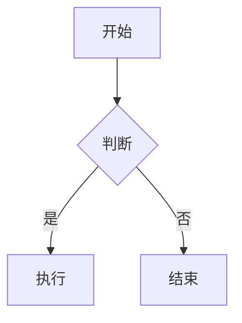
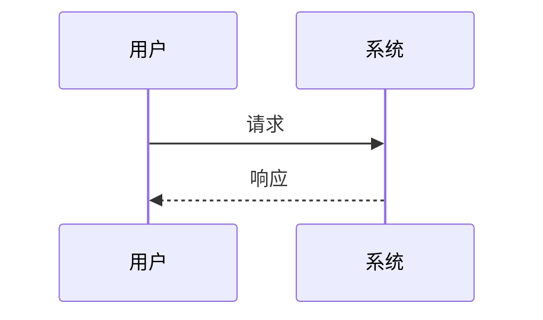
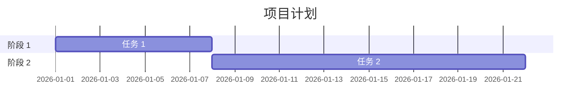
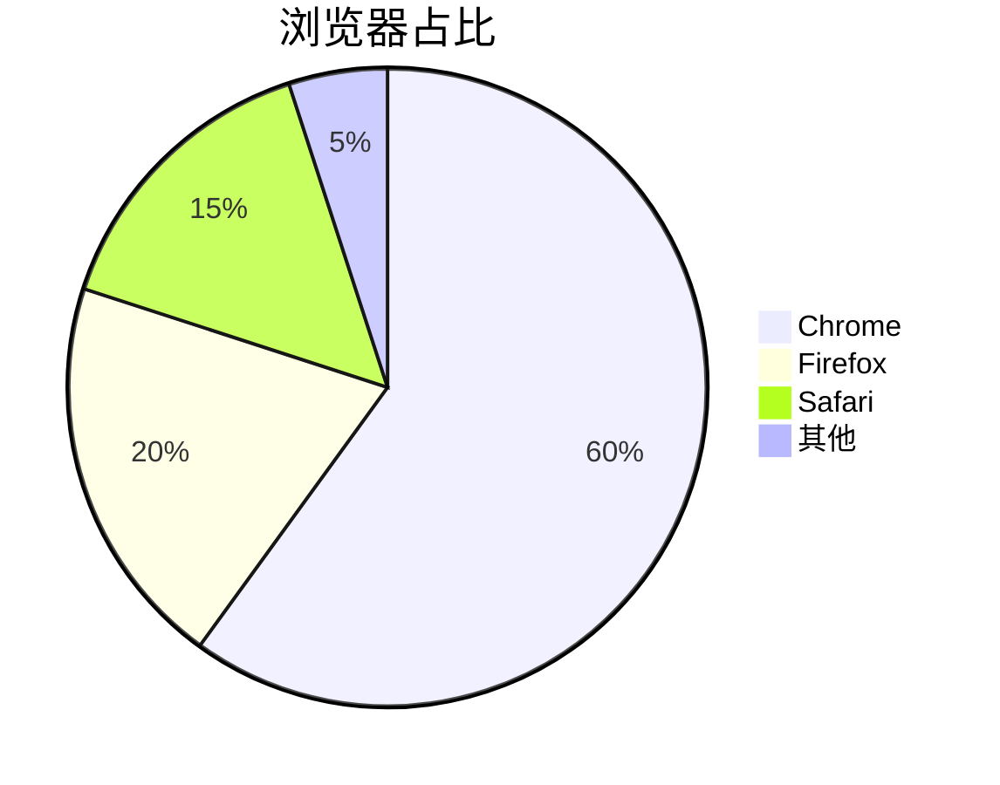

# Markdown 速查表 📋

快速参考指南，包含常用语法和示例。

---

## 📚 目录

- [标题](#标题)
- [文本格式](#文本格式)
- [列表](#列表)
- [引用](#引用)
- [代码](#代码)
- [链接和图片](#链接和图片)
- [表格](#表格)
- [分隔线](#分隔线)
- [任务列表](#任务列表)
- [脚注](#脚注)
- [公式](#公式)
- [Mermaid 图表](#mermaid-图表)

---

## 标题

```markdown
# 一级标题
## 二级标题
### 三级标题
#### 四级标题
##### 五级标题
###### 六级标题
```

---

## 文本格式

### 粗体
```markdown
**粗体文本**
__粗体文本__
```

### 斜体
```markdown
*斜体文本*
_斜体文本_
```

### 粗斜体
```markdown
***粗斜体文本***
___粗斜体文本___
```

### 删除线
```markdown
~~删除线文本~~
```

### 下划线
```markdown
<u>下划线文本</u>
```

### 行内代码
```markdown
`行内代码`
```

### 高亮
```markdown
==高亮文本==
```

---

## 列表

### 无序列表
```markdown
- 项目 1
- 项目 2
  - 子项目 2.1
  - 子项目 2.2
- 项目 3
```

### 有序列表
```markdown
1. 第一项
2. 第二项
   1. 子项 2.1
   2. 子项 2.2
3. 第三项
```

### 任务列表
```markdown
- [x] 已完成
- [ ] 未完成
- [ ] 待办
```

---

## 引用

```markdown
> 这是一个引用
> 可以包含多行
> > 嵌套引用
```

---

## 代码

### 行内代码
```markdown
`const x = 1;`
```

### 代码块
```markdown
```javascript
const x = 1;
console.log(x);
```
```

### 指定语言
```markdown
```python
def hello():
    print("Hello, World!")
```
```

---

## 链接和图片

### 链接
```markdown
[链接文本](https://example.com "标题")
```

### 图片
```markdown

```

### 自动链接
```markdown
<https://example.com>
<email@example.com>
```

---

## 表格

```markdown
| 表头 1 | 表头 2 | 表头 3 |
|:-------|:------:|-------:|
| 左对齐 | 居中   | 右对齐 |
| 内容   | 内容   | 内容   |
```

---

## 分隔线

```markdown
---
***
___
```

---

## 任务列表

```markdown
- [x] 任务 1
- [ ] 任务 2
- [ ] 任务 3
```

---

## 脚注

```markdown
这是一个带脚注的句子[^1]

[^1]: 脚注内容
```

---

## 公式

### 行内公式
```markdown
这是一个公式：$E = mc^2$
```

### 块级公式
```markdown
$$
\sum_{i=1}^{n} i = \frac{n(n+1)}{2}
$$
```

---

## Mermaid 图表

### 流程图
```markdown

```

### 时序图
```markdown

```

### 甘特图
```markdown

```

### 饼图
```markdown

```

---

## HTML 嵌入

### 折叠块
```markdown
<details>
<summary>点击展开</summary>

这里是隐藏内容。

</details>
```

### 键盘按键
```markdown
使用 <kbd>Ctrl</kbd> + <kbd>C</kbd> 复制
```

### 提示框
```markdown
> [!NOTE]
> 提示信息

> [!WARNING]
> 警告信息

> [!IMPORTANT]
> 重要信息

> [!TIP]
> 小技巧
```

---

## 转义字符

```markdown
\* 不会被解析为斜体 \*
```

---

## 注释

```markdown
<!-- 这是注释，不会显示 -->
```

---

## 常用快捷键（VS Code）

| 快捷键 | 功能 |
|--------|------|
| `Ctrl + B` | 粗体 |
| `Ctrl + I` | 斜体 |
| `Ctrl + K` `Ctrl + V` | 粘贴为链接 |
| `Ctrl + Shift + V` | 预览 |
| `Ctrl + /` | 注释 |
| `Ctrl + F` | 查找 |
| `Ctrl + H` | 替换 |

---

## 常用工具

### 在线编辑器
- [StackEdit](https://stackedit.io)
- [Dillinger](https://dillinger.io)
- [Markdown Live](https://markdownlivepreview.com)

### 转换工具
```bash
# Pandoc
pandoc input.md -o output.pdf
pandoc input.md -o output.html
pandoc input.md -o output.docx
```

### 格式检查
```bash
# Markdownlint
markdownlint README.md

# Vale
vale README.md
```

---

## 最佳实践提示

1. ✅ **使用正确的标题层级**
2. ✅ **段落之间空一行**
3. ✅ **使用描述性链接文本**
4. ✅ **为图片添加 alt 文本**
5. ✅ **代码块指定语言**
6. ✅ **表格对齐表头**
7. ✅ **保持术语一致**
8. ✅ **提供完整示例**

---

## 常见问题

### Q: 如何插入特殊符号？
**A:** 使用转义字符 `\`，例如：`\*` 显示为 *

### Q: 如何创建锚点？
**A:** 使用 `[链接文本](#锚点名称)`，锚点对应标题（小写，空格用 `-` 替换）

### Q: 如何调整图片大小？
**A:** 使用 HTML：``

### Q: 如何在表格中换行？
**A:** 使用 `<br>`：`第一行<br>第二行`

---

## 参考资源

- [CommonMark 规范](https://commonmark.org/)
- [GitHub Flavored Markdown](https://github.github.com/gfm/)
- [Markdown 指南](https://markdownguide.org/)

---

**版本：** 1.0.0  
**最后更新：** 2026-02-02
